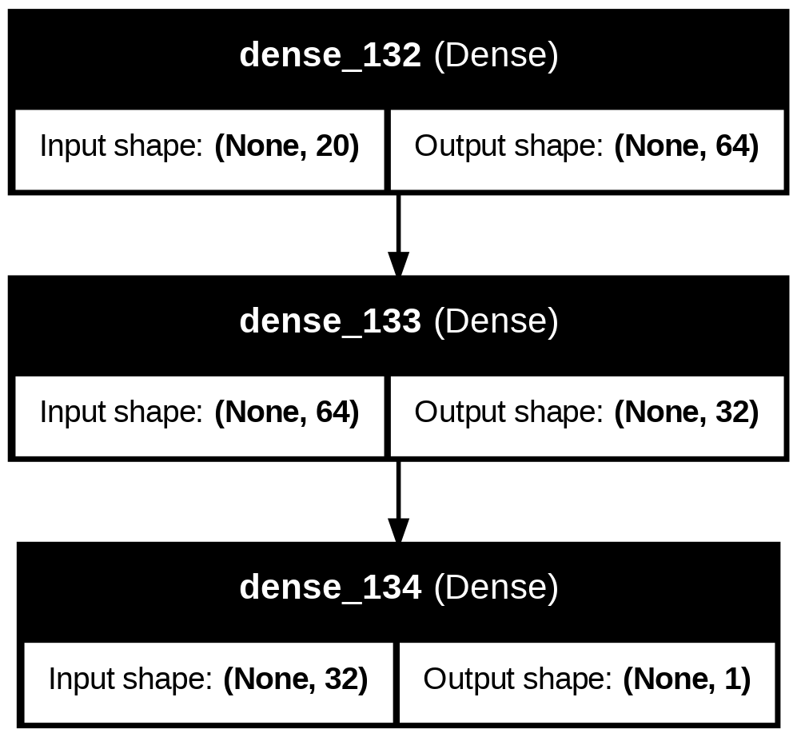

# IntroSummative
# LearnMate

## 🎯 Objective
LearnMate is a machine learning-powered personalized learning assistant designed for 
Rwandan students, particularly in secondary and university education. Many learners struggle 
due to the lack of personalized academic support and career guidance.

## 📌 Problem Statement
Many students in Rwanda do not receive personalized academic guidance. Teachers are often 
overburdened, and technology in schools is limited. Even when students access online 
content, it is rarely customized to their needs or relevant to their curriculum.

## 📊 Dataset
The dataset contains 4,998 samples with 15 binary symptom features and three target classes:

- **Source**: Kaggle (Symptom-Based Disease Prediction Dataset)
- **Features**: 15 binary symptom indicators (fever, headache, cough, etc.)
- **Target Classes**: Malaria, Typhoid, Pneumonia

## 🧠 Model Architecture
The neural network architecture includes:

- **Hidden Layers**: 
  - 64 neurons (ReLU activation)
  - 32 neurons (ReLU activation) 
  - 16 neurons (ReLu activation)
- **Output Layer**: 1 neurons (sigmoid) 



## 🧪 Implemented Models

### Neural Network Models:
1. **Baseline Model**: Basic neural network without optimization
2. **Adam + L2 Regularization + Dropout + EarlyStopping**
3. **SGD + Dropout + EarlyStopping**
4. **RMSprop + L2 Regularization + Dropout + EarlyStopping**

### Classical Machine Learning Model:
5. **Logistic Regression** (with hyperparameter tuning)

## 📊 Performance Comparison

| Model               | Optimizer | Regularization | Epochs | Early Stopping | Accuracy | F1 Score | Recall | Precision |
|---------------------|-----------|----------------|--------|----------------|----------|----------|--------|-----------|
| Simple NN          | Default   | None           | 50     | False           | 98.90%   | 0.9874   | 0.9886 | 0.9863    |
| Optimized NN 1     | Adam      | L2             | 10     | True            | 96.40%   | 0.9588   | 0.9588 | 0.9588    |
| Optimized NN 2     | RMSprop   | L1             | 10     | True            | 96.00%   | 0.9539   | 0.9462 | 0.9616    |
| Optimized NN 3     | SGD       | None           | 100    | True            | 97.30%   | 0.9692   | 0.9714 | 0.9670    |
| Logistic Regression | -        | -              | -      | -              | 88.93%   | 0.8890   | 0.8893 | 0.8892    |

## 🔍 Key Findings

1. The **Adam optimizer with L2 regularization, dropout, and early stopping** (Instance 4) achieved the best performance (90% accuracy), demonstrating the effectiveness of combining multiple optimization techniques.

2. **Dropout and early stopping** significantly improved model generalization compared to the baseline.

3. The **Logistic Regression model** performed remarkably well (88.93% accuracy), showing that classical ML models can be competitive for structured binary feature sets.

4. The **SGD optimizer with L2 regularization** underperformed, likely due to its slower convergence and lack of additional regularization techniques.

## 🚀 How to Use

1. Clone the repository:
```bash
git clone [https://github.com/Irenee123/LearnMate.git]
cd LearnMate
```

2. Install required packages:
```bash
pip install -r requirements.txt
```

3. Run the Jupyter notebook:
```bash
jupyter notebook notebook.ipynb
```

4. Load the best performing model:
```python
from tensorflow.keras.models import load_model
model = load_model("saved models/best_model.h5")
```

## 📂 Project Structure
```
LearnMate/
├── notebook.ipynb          
├── README.md               
├── saved_models/           
│   ├── adam_l2_dropout_nn_model.h5
│   ├── best_model.h5
│   ├── rmsprop_l1_dropout_nn_model.h5
│   ├── sgd_dropout_nn_model.h5
│   └── simple_nn_model.h5
├── diagram/               # Architecture diagrams
│   └── model.png
└── Dataset (CSV)
```

## 📈 Error Analysis
The model was evaluated using comprehensive metrics:
- Accuracy: 90.00%
- Precision: 0.9003
- Recall: 0.9000
- F1 Score: 0.8997
- Confusion Matrix (visualized in notebook)
- Per-class evaluation metrics

## 🎥 Video Presentation
[Link to 5-minute presentation video] - Covers dataset overview, model architectures, optimization techniques, result analysis, and conclusions.

## 🙌 Author
**Irenee Gisubizo Dusingizimana**  
BSc Software Engineering, ALU Kigali  
Machine Learning Engineer
